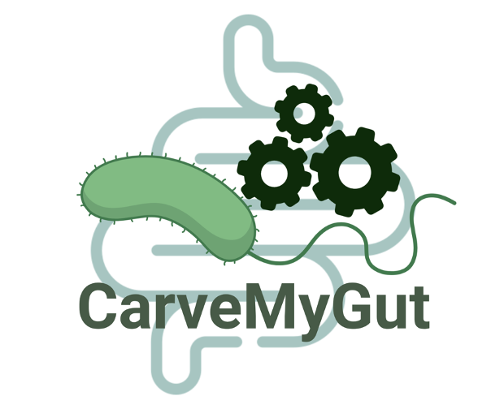

<p align="center">
  
</p>
# CarveMeGut

CarveMeGut is a Python package designed for metabolic model reconstruction 
and curation, particularly tailored for gut microbiome studies. It 
automates the process of drafting genome-scale 
metabolic models using various datasets and computational methods.

## Features
- Automated metabolic model reconstruction from genome sequences
- Integration with public metabolic databases
- Gap-filling for incomplete metabolic networks
- Support for various file formats (FASTA, SBML, etc.)
- CLI tools for streamlined workflows

## Installation

CarveMeGut requires Python 3.7 or higher. Install it using pip:

```sh
pip install carvemegut
```
Test the installation with:
```sh
carvemegut-carve --help
```
The database is automatically pulled from [zenodo](https://zenodo.org/records/14882984) and placed in the correct repository during the installation. 


Alternatively, you can install the latest development version from GitHub:
```sh
git clone https://github.com/yourusername/carvemegut.git
cd carvemegut
pip install .
```


## Usage

### CLI Usage

CarveMeGut provides a command-line interface (CLI) for ease of use. After 
installation, you can use:

```sh
carvemegut-carve --input genome.fasta --output model.xml
```

For a list of available options:
```sh
carvemegut-carve --help
```

## Configuration

CarveMeGut allows customization through a configuration file 
(`config.cfg`). This file contains parameters for model reconstruction, 
database paths, and computational settings.

## License

CarveMeGut is released under the MIT License.

## Contact
For questions or issues, please open an issue on 
[GitHub](https://github.com/arianccbasile/carvemegut/issues).

📢 **Stay tuned for the upcoming publication!**
